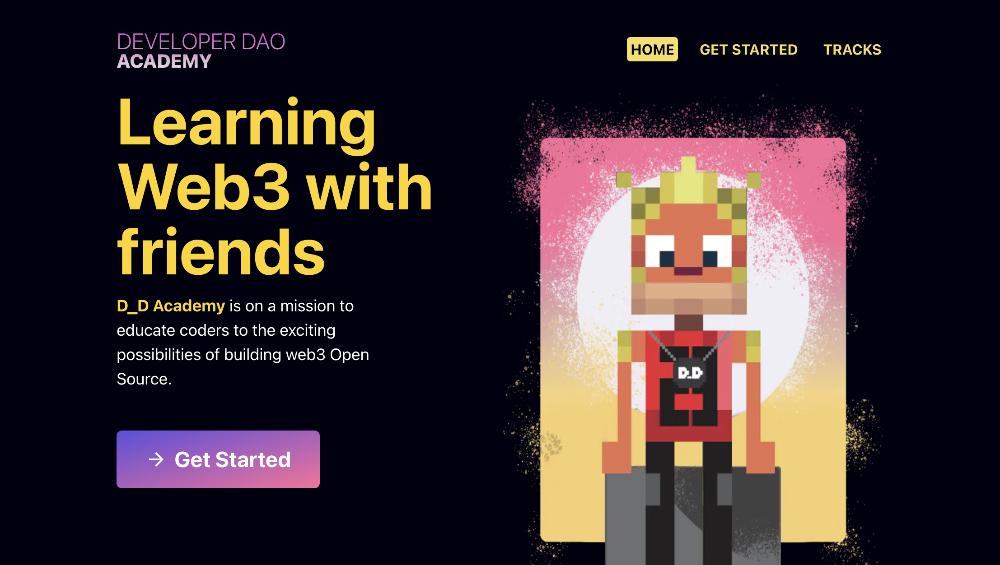

## Developer DAO Academy

`Developer DAO Academy` is an open-source education platform created by the
Developer DAO.

Live site is at <https://academy.developerdao.com>.



## How do I get started?

Please read our [CONTRIBUTING Guide](CONTRIBUTING.md) to get started. We ask
that you are a member of Developer DAO to contribute, since our project uses
various Developer DAO planning and communication tools, such as Discord.

## How to contribute code

If you're new to the project, see below for setup instructions.

### Considerations as you write code

As you're working on code, some things to think about:

- PRs should be as small as possible so they are easy to review
- There are strategies you can use to keep PRs small, even if your feature is
  big.
  [How to Split Pull Requests – Good Practices, Methods and Git Strategies](https://www.thedroidsonroids.com/blog/splitting-pull-request)

### What should I do before submitting the PR?

- Run `yarn confirm` which will make sure your files are consistently formatted,
  lint the code base looking for problems and then actually building the site
  locally to ensure no build problems
- If you see warnings or errors please fix.
- Also, this step runs Prettier so some files may have changed and need to be
  checked in.

Now you're ready to submit your PR.

Assume no one knows what your PR is about. So helpful to:

- writing a description in the PR to explain what you're fixing/adding and how
  to test.
- if your work is based on a GitHub issue, add that in the description, though
  make sure you use the exact words of "Closes #123" since this will
  automatically close the issue when the PR is merged. Using "this refers to
  #123" won't do that.
- send a signal that your PR is ready for review, such as asking someone to
  review your PR

### How do I review a PR?

It's also important that people review PRs -- a great learning experience and
important for an open-source project.

Some helpful things when reviewing PRs:

- **ALWAYS** download and run the code you're reviewing. Never eyeball it in the
  PR and approve it.
- when you review a PR, please add yourself as a reviewer in GitHub so we know
  someone is reviewing
- go through the formal GitHub review process of starting a review and then
  finishing with "approved" or "needs changes"

### Who should merge the PR?

Once a PR is reviewed, the author of the PR should merge, and the author should
run through the live site and make sure the code is performing as expected.

## Project Setup

**Prerequisites:**

    node --version 16.x

Refer to the `node` and `npm` installation with `nvm` guide in Lesson 2. A link
to the guide can be found
[here](https://www.notion.so/How-to-install-node-js-and-npm-67b2ab1f76f148f49f547b9156aeaf28):

**Fork this repo, clone forked repo locally and `cd` into the repo:**

    git clone https://github.com/[YOUR GITHUB HANDLE HERE]/academy.git
    cd academy/

**Installation and run:**

    yarn install
    yarn dev

This will create a local instance of the app running and can be viewed at
`http://localhost:3000` in your browser.

Also it's handy to install the Prettier plugin for your browser. You can then
use it to automatically format files. It helps keep the code base tidy, for
Typescript, MDX and Markdown files.

**VSCode Remote Containers (alternative setup)**

If you use VSCode for development, we already have the configuration files for
you to use
[Remote Containers](https://code.visualstudio.com/docs/remote/containers) (make
sure that you check the link to install the requirements to use it) to easily
create an isolated development environment for your fork. After installing the
minimum requirements, you can start using it following this
[quickstart](https://code.visualstudio.com/docs/remote/containers#_quick-start-open-a-git-repository-or-github-pr-in-an-isolated-container-volume).

## Grabbing latest version of the code

**Since this is a work in progress, your local version of the app can be updated
with the following commands:**

Stop the locally running app with:

    Ctrl + C

Use `git pull` for the most up-to-date version:

    git pull

Reinstall with `yarn`:

    yarn install

Run the updated app:

    yarn dev

## Learn More

To learn more about Next.js, take a look at the following resources:

- [Next.js Documentation](https://nextjs.org/docs) - learn about Next.js
  features and API.
- [Learn Next.js](https://nextjs.org/learn) - an interactive Next.js tutorial.

You can check out
[the Next.js GitHub repository](https://github.com/vercel/next.js/) - your
feedback and contributions are welcome!

## Storybook

This project uses [Storybook](https://storybook.js.org/). Storybook allows us to
develop components in isolation from our app.

Stories are loaded from `*.stories.(mdx|js|jsx|ts|tsx)` files in any directory.

To use Storybook, run the `storybook` script:

```bash
yarn storybook
```

To learn more about how to write Storybook stories, check out the official
[Intro to Storybook](https://storybook.js.org/tutorials/intro-to-storybook/)
tutorial.

## Deploy on Vercel

The easiest way to deploy your Next.js app is to use the
[Vercel Platform](https://vercel.com/new?utm_medium=default-template&filter=next.js&utm_source=create-next-app&utm_campaign=create-next-app-readme)
from the creators of Next.js.

Check out our
[Next.js deployment documentation](https://nextjs.org/docs/deployment) for more
details.
